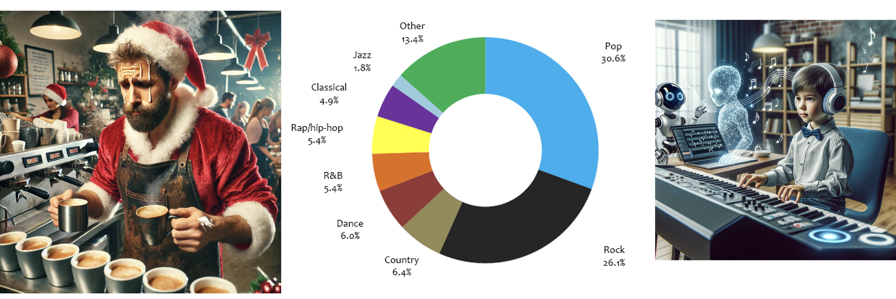

# Motivation

Imagine you are managing a café during the Christmas season. The easiest way to create a festive mood is to play Christmas music. However, finding carol songs that perfectly match your café’s atmosphere can be challenging.

Similarly, if you are a fan of a niche music genre like jazz, which only makes up 1.8% of the music market (compared to Pop at 30.6% and Rock at 26.1%), it can be hard to find enough variety of songs in your preferred style.

For aspiring musicians who want to compose songs but lack musical knowledge, creating just one piece of music could take years of effort.

In all of these cases, generative AI can offer a solution. Existing text-to-music AI models, however, often fail to produce music that aligns with a user’s imagination.

To address this, we propose MTM (Music to Text to Music):
*   Our system generates new music based on an auto-captioned prompt from a given short music sample.
*   Users can modify the generated music further through custom instructions to achieve the desired output.

By combining user creativity with AI-assisted music generation, we aim to bring diverse, personalized, and accessible music creation to everyone.

This content retains the original intent while being more structured and suitable for a website’s Motivation section.